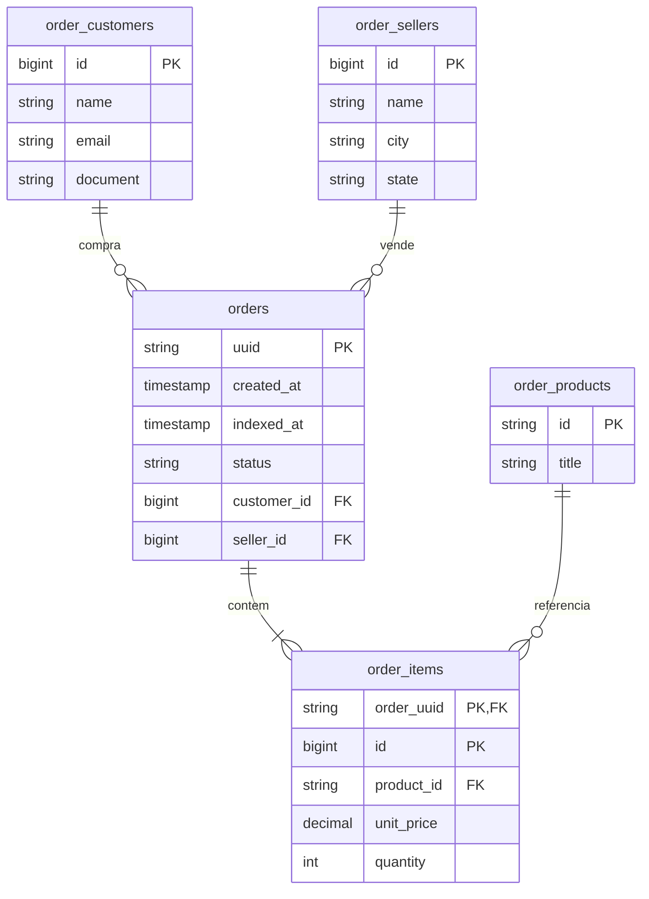

# Atividade independente de mensageria

Este projeto é separado do PI. Implementa o consumidor de pedidos de marketplace em TypeScript, PostgreSQL, Google Cloud Pub/Sub e a API REST do enunciado. O consumidor está configurado para a assinatura do grupo I fornecida pelo professor: `projects/serjava-demo/subscriptions/grupo-i`.

## Demonstração

Copie `sa-grupo-i-key.json` para a raiz do projeto. Esse arquivo é secreto, está ignorado pelo Git e não acompanha este projeto. Execute `docker compose up --build -d` e acompanhe a chegada de mensagens com `docker compose logs -f consumer`. O professor publica no tópico; a credencial recebida tem permissão apenas para consumir a assinatura. Consulte os pedidos já persistidos em:

- `http://localhost:3000/orders`
- `http://localhost:3000/orders/ORD-2026-0001`
- `http://localhost:3000/orders/ORD-2026-0001/items`
- `http://localhost:3000/orders/financial-summary`

Para encerrar, use `docker compose down`; o volume do PostgreSQL preserva os dados. O ACK é enviado apenas depois que o pedido é gravado. UUID repetido não cria outro pedido e mantém o primeiro horário de indexação.

`GET /orders` aceita `page`, `limit` (máximo 100), `customer.id`, `product.id`, `status` e `seller.id`, com ordenação por data decrescente. `GET /orders/financial-summary` aceita `seller.id`, `start_date` e `end_date` em ISO 8601. Os valores `total` de itens e pedidos são calculados na leitura. `indexed_at` registra a hora da gravação. O consumidor preserva o status recebido porque o payload de exemplo (`separated`) diverge da lista de considerações do enunciado.

## Demonstração local sem consumir mensagens reais

Para testar sem credencial e sem alterar a assinatura real, execute `docker compose -f docker-compose.emulator.yml up --build -d` e depois `docker compose -f docker-compose.emulator.yml exec consumer node dist/messaging/publish-example.js`. Essa configuração usa o emulador oficial do Pub/Sub e cria automaticamente tópico e assinatura locais. Para encerrá-la, use `docker compose -f docker-compose.emulator.yml down`.

## Execução sem Docker

Defina `GOOGLE_APPLICATION_CREDENTIALS` com o caminho absoluto para `sa-grupo-i-key.json`, `GOOGLE_CLOUD_PROJECT=serjava-demo`, `PUBSUB_SUBSCRIPTION=projects/serjava-demo/subscriptions/grupo-i` e `ORDERS_DATABASE_URL` para um PostgreSQL acessível. Depois execute `npm ci`, `npm run build` e `npm run consumer`. Nunca envie a chave ao GitHub ou a inclua em relatórios e capturas de tela.

## DER

O DDL completo está em `schema.sql`. Cliente, seller e produto são entidades próprias; o pedido referencia cliente e seller, e cada item referencia pedido e produto.

## Três integrantes

Cada integrante deve revisar, testar e registrar sua contribuição usando a própria identidade Git no repositório **desta atividade**, não no PI. O código foi preparado, mas não foram criados commits em nome de outras pessoas.

| Integrante | Parte sugerida | Arquivos |
|---|---|---|
| Hugo de Castro Rodrigues | Modelagem do banco e DER | `schema.sql`, seção DER deste README |
| Pablo Miguel Sousa Nobrega | Consumidor e publicação de exemplo | `src/messaging/store.ts`, `consumer.ts`, `start.ts`, `publish-example.ts` |
| Arthur Rodrigues Ferreira | Rotas, filtros, resumo financeiro e demonstração | `src/messaging/orders.routes.ts`, `src/server.ts`, `docker-compose.yml`, `docker-compose.emulator.yml`, `Dockerfile`, dependências e restante do README |

Para três commits genuínos, cada pessoa precisa revisar e assumir sua parte antes de publicar. A ordem sugerida é banco/DER, consumidor e API/demonstração.
