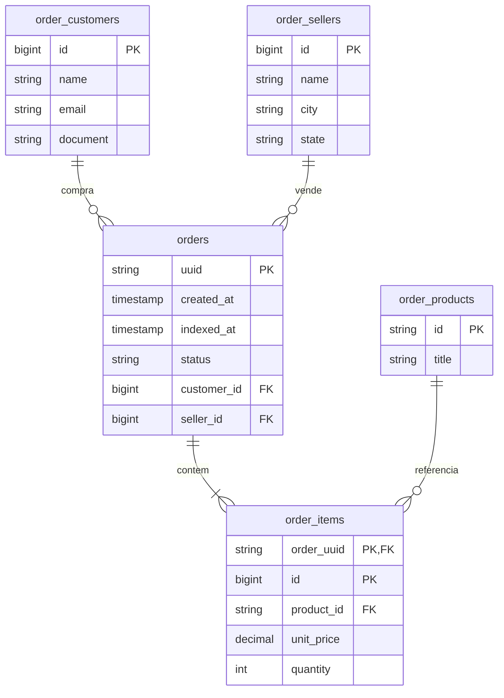

# Atividade de Mensageria

Projeto desenvolvido em TypeScript utilizando PostgreSQL e Google Cloud Pub/Sub para consumir e armazenar pedidos de um marketplace.

A assinatura utilizada pelo grupo é:

`projects/serjava-demo/subscriptions/grupo-i`

## Como executar

Coloque o arquivo `sa-grupo-i-key.json` na raiz do projeto e execute:

```bash
docker compose up --build -d
```

Para acompanhar as mensagens recebidas pelo consumer:

```bash
docker compose logs -f consumer
```

A API e o **Painel Web (Dashboard)** ficam disponíveis na porta 3000.

* Dashboard Web: `http://localhost:3000/`
* Endpoints REST:
  * `http://localhost:3000/orders`
  * `http://localhost:3000/orders/ORD-2026-0001`
  * `http://localhost:3000/orders/ORD-2026-0001/items`
  * `http://localhost:3000/orders/financial-summary`

## Front-End (Painel de Controle Web)

O projeto conta com uma interface Web interativa e responsiva desenvolvida em HTML5, Tailwind CSS e JavaScript:

* **Métricas Financeiras & KPIs**: Total de pedidos, receita acumulada, ticket médio e detalhamento de vendas por método de pagamento.
* **Distribuição de Status**: Visualização em tempo real do volume de pedidos por status (`created`, `paid`, `separated`, `shipped`, `delivered`, `canceled`).
* **Filtros Interativos**: Filtragem por status, ID do cliente, ID do vendedor e ID do produto com suporte a paginação ajustável.
* **Modal de Detalhes do Pedido**: Exibição completa de dados do cliente, vendedor, frete/pagamento (JSONB) e tabela de itens.

Para parar os containers:

```bash
docker compose down
```

Os dados do PostgreSQL ficam salvos no volume mesmo depois de encerrar os containers.

O ACK da mensagem é feito somente depois que o pedido é salvo no banco. Caso seja recebida novamente uma mensagem com o mesmo UUID, outro pedido não é criado.

## Filtros da API

A rota:

`GET /orders`

aceita os seguintes parâmetros:

* `page`
* `limit`
* `customer.id`
* `product.id`
* `status`
* `seller.id`

O limite máximo por página é 100 e os pedidos são retornados do mais recente para o mais antigo.

A rota:

`GET /orders/financial-summary`

aceita:

* `seller.id`
* `start_date`
* `end_date`

As datas devem estar no formato ISO 8601.

Os valores totais dos itens e dos pedidos são calculados na consulta. O campo `indexed_at` guarda o momento em que o pedido foi salvo no banco.

O status recebido na mensagem é mantido como veio no payload. Isso foi feito porque o exemplo utiliza o status `separated`, que não aparece na lista de status apresentada nas considerações da atividade.

## Teste local com Pub/Sub Emulator

Também é possível testar o projeto sem utilizar a assinatura real do Pub/Sub.

Execute:

```bash
docker compose -f docker-compose.emulator.yml up --build -d
```

Depois publique uma mensagem de exemplo:

```bash
docker compose -f docker-compose.emulator.yml exec consumer node dist/messaging/publish-example.js
```

Nesse modo é utilizado o emulador do Pub/Sub, com tópico e assinatura locais.

Para encerrar:

```bash
docker compose -f docker-compose.emulator.yml down
```

## Executando sem Docker

Para executar diretamente na máquina, configure as seguintes variáveis de ambiente:

```env
GOOGLE_APPLICATION_CREDENTIALS=/caminho/para/sa-grupo-i-key.json
GOOGLE_CLOUD_PROJECT=serjava-demo
PUBSUB_SUBSCRIPTION=projects/serjava-demo/subscriptions/grupo-i
ORDERS_DATABASE_URL=postgresql://...
```

Depois:

```bash
npm ci
npm run build
npm run consumer
```

O arquivo `sa-grupo-i-key.json` contém a credencial de acesso e não deve ser enviado para o GitHub.

## DER



O DDL utilizado para criação das tabelas está no arquivo `schema.sql`.

Cliente, vendedor e produto possuem suas próprias tabelas. O pedido referencia o cliente e o vendedor, enquanto os itens relacionam o pedido aos produtos.
