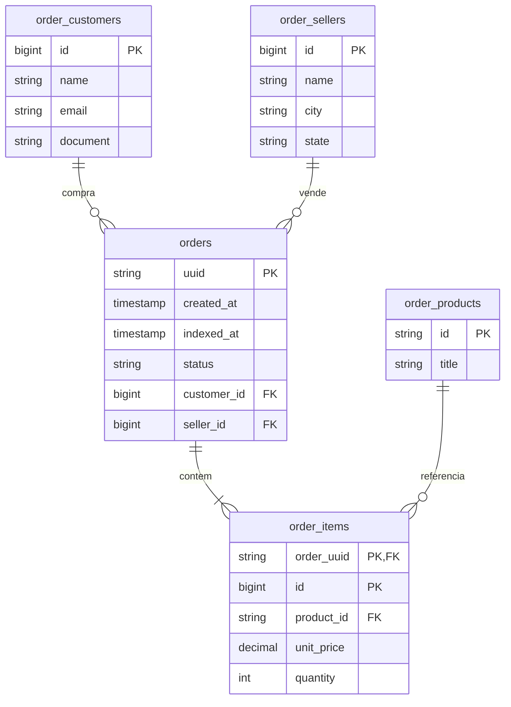

# Projeto Mensageria

Atividade independente de Computação em Nuvem II: consumo de pedidos de marketplace, persistência relacional e API REST. A implementação está dividida entre três integrantes para que cada um revise e registre sua contribuição com sua própria conta GitHub.

## Banco de dados e DER

O DDL está em `schema.sql`. `orders` representa o pedido, `order_customers` o cliente, `order_products` o produto e `order_items` os itens. A tabela `order_sellers` guarda o vendedor solicitado no payload e nos filtros. `indexed_at` registra o momento em que a mensagem foi persistida. Valores monetários são armazenados com `NUMERIC(14,2)`; totais serão calculados pela API a partir de preço unitário e quantidade.

## Próximas contribuições

| Integrante | Parte | Arquivos previstos |
|---|---|---|
| Hugo | Banco, DER e base TypeScript | `schema.sql`, `README.md`, `package.json`, `package-lock.json`, `tsconfig.json`, `.gitignore` |
| Pablo | Consumidor RabbitMQ e gravação transacional | `src/messaging/store.ts`, `consumer.ts`, `start.ts`, `publish-example.ts` |
| Arthur | API REST, filtros, resumo financeiro e demonstração | `src/messaging/orders.routes.ts`, `src/server.ts`, `Dockerfile`, `docker-compose.yml` |

Pablo e Arthur devem atualizar este guia com os detalhes de execução ao concluir suas partes. O nome completo de Arthur ainda precisa ser confirmado.
